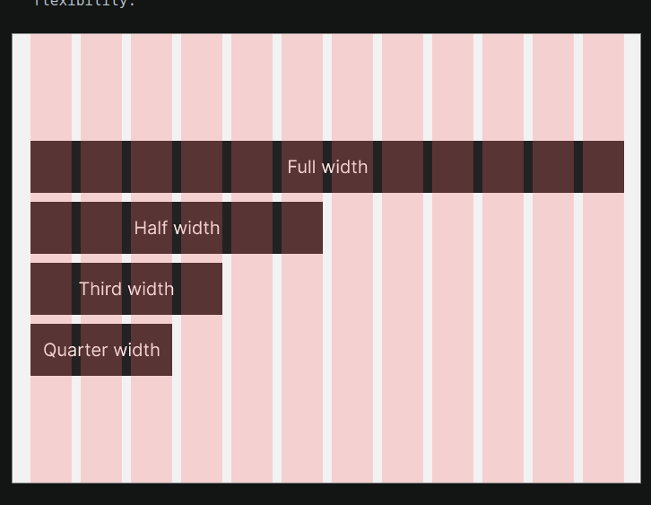

in this chapter we will learn
    > UI design fundamentals
            typpography
    > Build a layout
        a page
    > gary simon will teach the last module.

 
Design patterns 

    . Dark mode 
    - Card layouts
    - Modal dialogs
    - Shopping carts
    - Bredcrumbs
    - More

 

16. Uses at least 1.5 line height for body text.

notes from here:
    > Visual design rules you can safely follow every time.
        > Use near-black and near-white insted of puyre black and white.
        > Saturate your neutrals
            A neutral is generally a black, white or grey. If you use colour in your interface, add a little bit of that colour to your interface, add a little bit of that colour to your neutrals. This will make the colour palette feel more coherent. If you use the HSB colour system less than 5% saturation should do it.
        > Use high comtrast foir importannt elements
        > Everythiung in your design should be deliberate
        > Lower letter spacing and line height with larger text. Raise them with smaller text.
            this applies to all text. The bigger the text the less space you nedd betwenn each lettter and each line . The reverse is also true.
        > Container borders should contrast with both the container  and the background.
        > If you use a horizontal grid, use 12 columns
        

    > Closer  elements should be lighter.

    Common design & no-dev roles

    User researcher
        undesrtastan user behaviours an needs
        gather and analyuse data

    UX designer
        figma and stuff
    
    UI designer
        focus on designing the user interface
    
    USER research & testinng

class

white spaces

    using padding is good behavioor. 
    using m units. remember of line  -heigth

Alignement 

every element is positioned correctly in relation to other elements.
